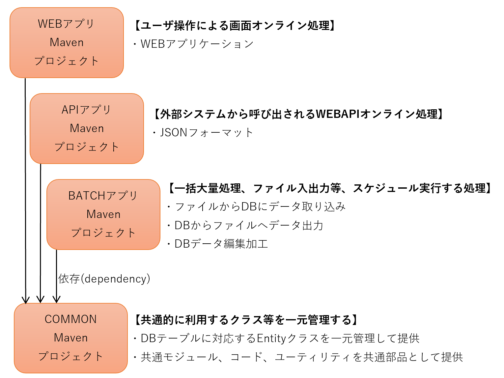

# spring-boot2-system

## やりたいこと

* システムは、WEBアプリケーション及びデータベースだけではなく、それ以外に様々な物事で構成されることを認識するべし
* まずはシステムに関して広く浅く知ろう。実際に経験するには時間がかかるが、知らない事を知るだけなら、すぐにできる
* JAVAプログラマーではなく、システムエンジニアになろう

## システム構成  
とある架空のシステム構成を以下に示す。  
３つのアプリケーション（WEBとAPIとBATCH）と１つのデータベースで構成されるシステムで、外部システム連携（APIとファイル連携）も存在する。  

* WEB：ユーザが画面操作するWEBアプリ
* API：外部システム向けにWEBAPIを提供する
* BATCH：バッチ処理を行う
* DB：上記３つのアプリが利用する

## 機能要件と非機能要件

* 機能はシステム化にあたり明示的に求められる「機能」を指す。システムが備えるべき処理や機能であり要件定義書やシステムフロー、業務フローとして整理及び定義される。変わりやすく、環境や状況の変化やユーザ部門、業務有識者の意向等により変化しやすいため、仕様変更が発生した場合には変更管理が必要。
* 非機能は性能、可用性、拡張性、運用、監視、セキュリティ等があり、見逃されがちで暗黙的で隠れやすい要求が多く、決定を行いずらくもある。明示的に非機能要求の整理を進めるための指標として、IPAより`非機能要求グレード`が提供されている。

## 関係者、チーム構成

* 顧客
  * ユーザ部門、利用部門
  * システム部門、システム子会社
  * ステークホルダー（経営層）
  * コンサル
  * etc
* SIer
  * アプリケーション開発
    * アプリ開発(自社、国内2次受パートナー、オフショア、ニアショア)
    * アプリ開発(機能毎、処理方式毎)
    * 構成管理、ライブラリ管理
    * リリース
    * DBA(データベース)
    * アプリケーションアーキテクト
    * 受け入れ検収
    * 品質管理
  * インフラ基盤
  * 保守運用
  * プロジェクトマネジメント（PM、PMO）
    * 進捗管理
    * 変更管理
    * スコープ管理
    * 課題管理
    * 品質管理
    * コミュニケーション管理
    * リスク管理
  * ステークホルダー（経営層）
  * etc
* その他
  * 製品ベンダー
  * セキュリティ診断サービス
  * etc

## システムのライフサイクル

* 新規開発
  * 企画、予算取り
  * 要求定義
  * 要件定義
  * 外部設計、基本設計
  * 内部設計、詳細設計
  * 実装
  * 単体テスト
  * 結合テスト
  * 総合テスト
    * 運用テスト
    * 性能テスト
    * セキュリティテスト
  * 受け入れテスト
  * 本番リリース
* 保守運用、保守開発
  * 定常運用、計画運用
  * 不定期運用、緊急対応
  * インシデント対応
  * 不具合対応
  * 追加要件、変更要件
  * セキュリティパッチ
  * バージョンアップ
* システム更改
  * ハードウェア、ソフトウェアサポート切れ（EOS、EOL）による更改
  * SIer変更を伴う全面リプレイス
  * 異なる言語へのマイグレーション(COBOL⇒JAVA)

## アプリケーション構成

Spring-Bootを使ったアプリケーションで、ライブラリ管理にはMavenを用いる。  
３つのアプリケーション（WEB、API、BATCH）と１つの共通プロジェクト（COMMON）で構成される。  
サンプルアプリケーションを配置済み

